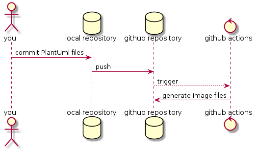

# What can I do

When you push to github repository, Image files(_.png) are generated from PlantUml files(_.pu) by GithubActions.

# Requirement

Only you need is pushing your PlantUml files.(No requirements)
If you want to demonstrate on your local machine, you need to install [Graphviz](https://graphviz.org/).

# Dependencies

- [Graphviz](https://graphviz.org/)
- [glob](https://www.npmjs.com/package/glob)
- [node-plantuml](https://www.npmjs.com/package/node-plantuml)

# Installation

1. Copy following files/folders to your repository

- .github/
- index.js
- package.json
- package-lock.json
- .gitignore

2. Set following secrets on your github repository
   - USERNAME : your github username
   - USERMAIL : your github mailaddress

# Usage

When using github actions, only you usage is pushing your PlantUml files to your github repository.
If you want to demonstrate on your local machine, you need:

1. npm ci
1. Create PlantUml file
1. npm run generate-png
